# SVG Animation Compatibility Gallery

This repository exists to experimentally test which SVG rendering and animation features show up well in normal browsers and in GitHub repository views, especially on the README homepage.

It is intentionally a static artifact generator rather than a frontend app:

- Bun is the runtime, package manager, and script runner
- TypeScript is used for all source files
- SVG files are generated programmatically into `generated/svg/`
- `README.md` includes a generated gallery so the committed SVGs are visible directly on GitHub

## Why this repo exists

GitHub does not always render SVGs the same way that a local browser does. Some features render as a static first frame, some survive sanitization, and some are stripped or ignored entirely. This repo makes those differences easy to inspect by direct experiment.

## Setup

```bash
bun install
```

## Generate artifacts

```bash
bun run generate
```

Useful scripts:

- `bun run generate` — generate SVGs, metadata, preview HTML, and refresh the README gallery
- `bun run regen` — alias for `generate`
- `bun run dev` — alias for `generate`
- `bun run clean` — remove generated artifacts
- `bun run check` — run the TypeScript typecheck
- `bun run count` — print the example count

## Generated outputs

- `generated/svg/` — standalone SVG compatibility experiments
- `generated/metadata.json` — structured metadata describing every example
- `generated/index.html` — a simple local preview page for browser-side inspection

## Expected GitHub rendering caveats

- Static SVG shapes, gradients, text, and many defs-based features often render well.
- SMIL and CSS animation may render as a static snapshot in GitHub even when they animate in a browser.
- Features like `foreignObject` and `script` are included as deliberate edge cases and are expected to be sanitized or ignored by GitHub.
- This repository records expectations, not guarantees; the point is to keep the experiment easy to rerun and inspect.

## Conclusion

The strongest GitHub candidates are the static and defs-based examples. SMIL and CSS animation examples are more likely to work fully in browsers while showing only a still frame on GitHub. `foreignObject` and `script` should be treated as browser-only or blocked negative tests.

<!-- GENERATED_GALLERY_START -->

## Generated gallery

Each example below is generated from TypeScript source. Re-run `bun run generate` to refresh the SVGs, metadata, preview page, and this gallery section.

## Basic static SVG controls

Baseline primitives and non-animated SVG features.

### clipPath example

A clipped pattern inside a circle to verify clipPath defs usage.

- **Expectation:** May work on GitHub
- **Notes:** clipPath often works, but it is useful to verify defs-heavy features directly in GitHub.
- **File:** `generated/svg/static-clip-path.svg`

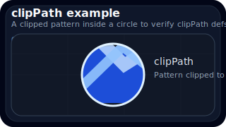

### Gradient fill

Linear gradient with a simple glossy badge shape.

- **Expectation:** May work on GitHub
- **Notes:** Gradient defs are commonly supported, but they verify that defs survive the renderer.
- **File:** `generated/svg/static-gradient-fill.svg`

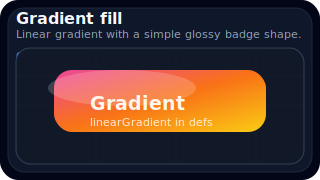

### Path and stroke

Curved path with visible control-point markers and thick stroke styling.

- **Expectation:** May work on GitHub
- **Notes:** Complex paths still render as plain SVG and are usually safe on GitHub.
- **File:** `generated/svg/static-path-stroke.svg`

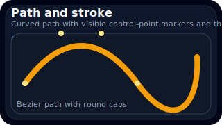

### Simple circle

Single filled circle with a baseline label and no animation.

- **Expectation:** May work on GitHub
- **Notes:** Plain shape rendering is typically stable in browsers and GitHub image rendering.
- **File:** `generated/svg/static-simple-circle.svg`

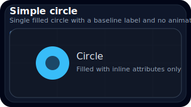

### Simple rect

Rounded rectangle with stroke and layered highlight.

- **Expectation:** May work on GitHub
- **Notes:** Inline rectangle geometry and stroke attributes should be broadly compatible.
- **File:** `generated/svg/static-simple-rect.svg`

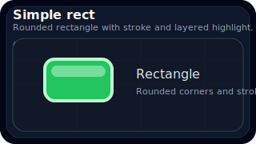

### Text example

Mixed text sizes and weights to probe plain SVG text rendering.

- **Expectation:** May work on GitHub
- **Notes:** SVG text generally works, though font metrics may vary between environments.
- **File:** `generated/svg/static-text-label.svg`

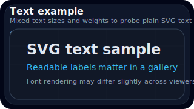

## SMIL animation primitives

SVG-native animation elements such as animate and animateTransform.

### SMIL additive accumulate

Stacks repeated translation and rotation using additive and accumulate behavior.

- **Expectation:** Likely works in browsers
- **Notes:** More advanced SMIL timing model coverage; if unsupported, the shape may appear static or partially animated.
- **File:** `generated/svg/smil-additive-accumulate.svg`

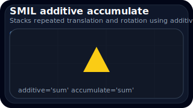

### SMIL animate for cx

Moves a circle horizontally by animating the cx attribute.

- **Expectation:** Likely works in browsers
- **Notes:** A direct animate-on-attribute test. Browsers usually support it, while GitHub may show only the initial frame.
- **File:** `generated/svg/smil-animate-cx.svg`

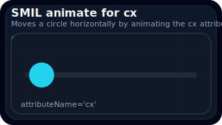

### SMIL animate for fill

Cycles a rectangle through multiple fill colors.

- **Expectation:** Likely works in browsers
- **Notes:** Good for checking whether animated presentation attributes survive rendering.
- **File:** `generated/svg/smil-animate-fill.svg`

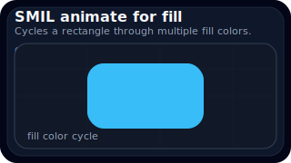

### SMIL animateMotion path follow

Moves a dot along a visible guide path.

- **Expectation:** Likely works in browsers
- **Notes:** animateMotion is historically less universal than basic animate, making it a good compatibility probe.
- **File:** `generated/svg/smil-motion-path.svg`

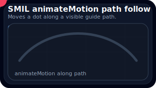

### SMIL multiple animate elements

Animates position, radius, and fill on one element at the same time.

- **Expectation:** Likely works in browsers
- **Notes:** Good for testing whether multiple child animation nodes on the same target are all honored.
- **File:** `generated/svg/smil-multiple-animations.svg`

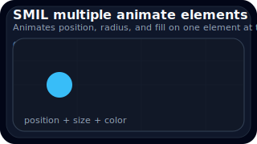

### SMIL opacity pulse

Pulses element opacity with a simple animate element.

- **Expectation:** Likely works in browsers
- **Notes:** Useful for determining whether opacity changes animate or only the static state is shown.
- **File:** `generated/svg/smil-opacity-pulse.svg`

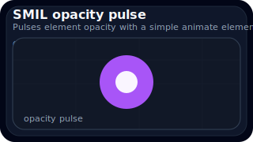

### SMIL set with timing offsets

Uses set elements to toggle visibility with begin offsets and durations.

- **Expectation:** Likely works in browsers
- **Notes:** Tests set timing behavior, which can be easier to reason about than full interpolation.
- **File:** `generated/svg/smil-set-toggle-timing.svg`


### SMIL transform rotate, scale, translate

Runs three animateTransform variants side-by-side.

- **Expectation:** Likely works in browsers
- **Notes:** Combines rotate, scale, and translate to compare transform-specific behavior in one SVG.
- **File:** `generated/svg/smil-transform-suite.svg`

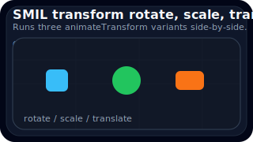

## Stroke drawing effects

Dash-based reveal and looping stroke animations.

### Circular progress animation

A circular arc animates with stroke dashes like a progress ring.

- **Expectation:** Likely works in browsers
- **Notes:** The static ring should render everywhere; the animated progress effect may be browser-only in practice.
- **File:** `generated/svg/stroke-circle-progress.svg`

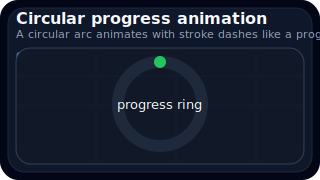

### Stroke dash reveal

Uses dash offset animation to reveal a polyline drawing.

- **Expectation:** Likely works in browsers
- **Notes:** Dash styling usually renders on GitHub, but animation may not play there.
- **File:** `generated/svg/stroke-dash-reveal.svg`

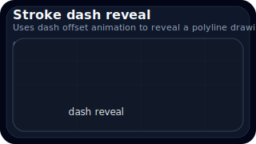

### Looping line draw

A looping rectangular route continuously redraws itself.

- **Expectation:** Likely works in browsers
- **Notes:** This is still SMIL-based, so browser support is stronger than GitHub playback.
- **File:** `generated/svg/stroke-loop-draw.svg`

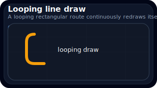

## CSS-based SVG animation experiments

Inline style blocks, classes, and CSS keyframe animation inside SVG.

### CSS color transition

Class-based color cycling for a central badge.

- **Expectation:** May work on GitHub
- **Notes:** Embedded style tags may be preserved in some contexts but are not guaranteed on GitHub.
- **File:** `generated/svg/css-color-transition.svg`

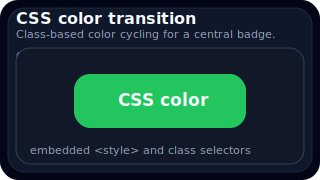

### CSS keyframes movement

Inline style block animating horizontal movement with keyframes.

- **Expectation:** May work on GitHub
- **Notes:** CSS animation inside SVG tends to work in browsers, but GitHub may render a static first frame.
- **File:** `generated/svg/css-keyframes-move.svg`

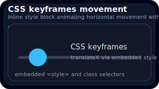

### CSS opacity blink

Simple blinking dots using a shared class and staggered timing.

- **Expectation:** May work on GitHub
- **Notes:** A useful experiment for whether CSS animation survives sanitization or becomes a static snapshot.
- **File:** `generated/svg/css-opacity-blink.svg`

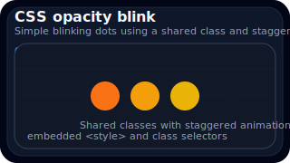

### CSS stroke reveal

Path reveal using stroke-dashoffset animated through CSS.

- **Expectation:** May work on GitHub
- **Notes:** This combines class-based styling and dash animation, which is informative for browser-vs-GitHub comparisons.
- **File:** `generated/svg/css-stroke-reveal.svg`

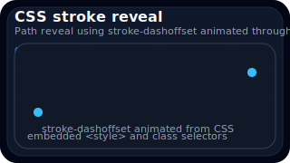

## Feature edge cases

Reuse, filters, and features that are often sanitized or inconsistent.

### Filter with drop shadow

Uses a blur and offset filter chain to simulate a shadowed card.

- **Expectation:** May work on GitHub
- **Notes:** Basic filters often work in browsers, but GitHub may sanitize or flatten them differently.
- **File:** `generated/svg/edge-filter-shadow.svg`

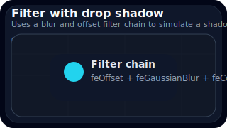

### foreignObject HTML block

Embeds HTML inside the SVG as a browser-oriented compatibility edge case.

- **Expectation:** Likely sanitized or ignored on GitHub
- **Notes:** foreignObject content is a known sanitization risk and is often stripped or rendered inconsistently on GitHub.
- **File:** `generated/svg/edge-foreign-object.svg`


### Script tag negative test

Includes a tiny script to confirm that active content is blocked or ignored.

- **Expectation:** Likely sanitized or ignored on GitHub
- **Notes:** Script execution in SVG is typically blocked in repository rendering for security reasons.
- **File:** `generated/svg/edge-script-negative.svg`

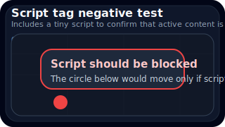

### Symbol and use reuse

Reuses one symbol instance at multiple sizes to test defs-based reuse.

- **Expectation:** May work on GitHub
- **Notes:** Symbol and use are usually preserved, but symbol references are still worth checking in repository rendering.
- **File:** `generated/svg/edge-symbol-reuse.svg`

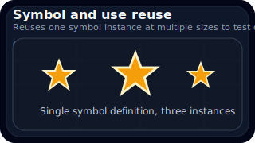

<!-- GENERATED_GALLERY_END -->

